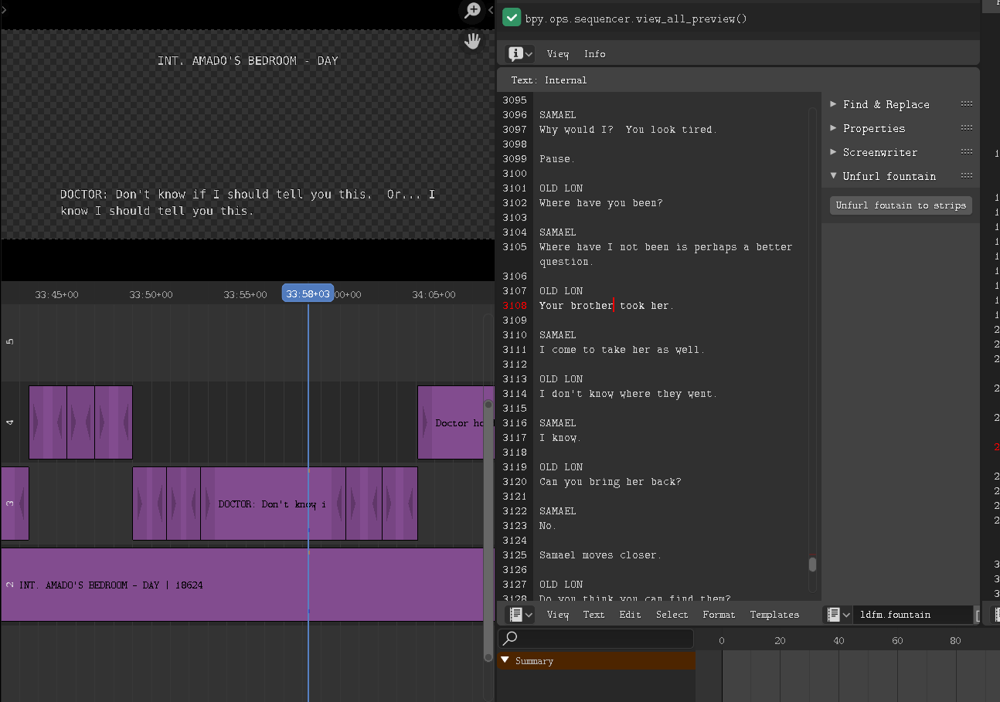

= blender addon unfurl fountain

A minimalist repurposing of https://github.com/tin2tin[tin2tin]'s https://github.com/tin2tin/Blender_Screenwriter[ `text.scenes_to_strips` operator ]

Creates text scripts for all scenes, dialogues and actions from a fountain file.
To use, click on the `Unfurl fountain to strips` button on the text editor for a fountain file.

== About

Based on work from 
https://github.com/tin2tin[tin2tin]
and, as https://github.com/tin2tin/Blender_Screenwriter/blob/master/README.md[he explains], 
[quote, tin2tin]
The Fountain screenplay format is by Nima Yousefi & John August; original code for Objective-C at https://github.com/nyousefi/Fountain. It is ported to Python 3 by Colton J. Provias, improved by Manuel Senfft https://github.com/Tagirijus/fountain. 
